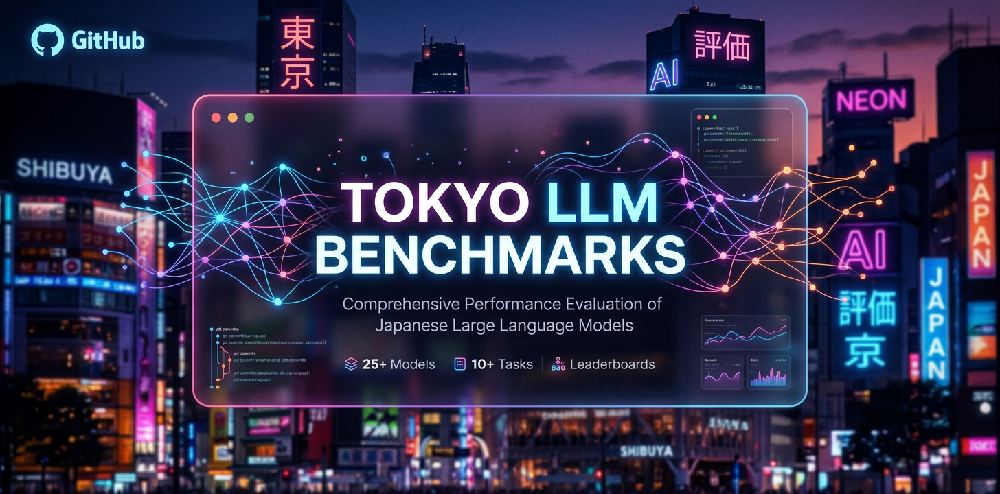

<div align="center">
  

  # 🏙️ Tokyo LLM Benchmarks

  **Real-time interactive dashboard visualizing the convergence of Open-Weight and Proprietary Large Language Models.**<br>
  *Built by [LIN4CRE](https://github.com/LIN4CRE) • Data updated as of July 14, 2026*

  [](https://github.com/LIN4CRE/LLM-Tokyo-Benchmarks/actions)
  [](https://opensource.org/licenses/MIT)
  [](https://LIN4CRE.github.io/LLM-Tokyo-Benchmarks/)
</div>

---

## 🔮 The 2026 Landscape

The open-weights landscape of **July 14, 2026**, has nearly vaporized the gap between self-hosted "free" models and proprietary "paid" giants. With powerhouse architectures like **GLM-5.2 Max** and **DeepSeek V4 Pro** trading blows directly with **GPT-5.5** and **Claude Fable 5**, keeping track of the leaderboard requires constant vigilance.

This repository hosts a premium interactive dashboard utilizing a **glassmorphic Tokyo-night theme**. It isolates **Free** models in glowing neon green and **Paid** models in high-contrast neon orange.

## ✨ Features

- **Pristine Dark Glass UI:** Highly polished CSS4 glassmorphism with dynamic ambient background blobs.
- **Interactive Data Visualization:** Powered by Chart.js for smooth, animated 24-hour rolling average Elo tracking.
- **Simulated Terminal Sync:** A custom "Scrape & Sync" button that mimics connecting to `arena.ai` and `llm-stats.com` via a mock terminal output stream.
- **Categorized AI Models:** Instantly visually parse proprietary behemoths (Claude Fable 5, Gemini 3.1 Pro) vs open-weight heroes (GLM-5.2 Max, Mimo V2.5 Pro).

## 🚀 Getting Started

### Local Development

1. Clone the repository:
   ```bash
   git clone https://github.com/LIN4CRE/LLM-Tokyo-Benchmarks.git
   cd LLM-Tokyo-Benchmarks
   ```
2. Open `src/index.html` in your favorite browser. No build steps required!

### Live Deployment

The project is continuously deployed to GitHub Pages via automated GitHub Actions on every push to `main`. 

## 🤖 The Data

Based on scraped data matching July 2026 Arena logic:

| Model Class | Model Name | Arena Elo Score | Access Cost |
| --- | --- | --- | --- |
| **Paid** | Claude Fable 5 | 1509 | $10.00 / M tokens |
| **Paid** | GPT-5.5 Pro | 1506 | $30.00 / M tokens |
| **Paid** | Gemini 3.1 Pro | 1485 | $2.00 / M tokens |
| **Free** | GLM-5.2 Max | 1469 | Free / self-hostable |
| **Free** | Mimo V2.5 Pro | 1466 | Free / self-hostable |
| **Free** | DeepSeek V4 Pro | 1457 | Free / self-hostable |

## 🛠️ Architecture

- **HTML5** Semantic Structure
- **CSS4** Custom properties, flex/grid layouts, advanced backdrop-filters, custom keyframe animations.
- **Vanilla JavaScript** (ES6+) for DOM manipulation and terminal logic.
- **Chart.js** for responsive canvas rendering.
- **GitHub Actions** for CI/CD deployment.

## 🤝 Contributing

Contributions, issues, and feature requests are welcome! Feel free to check the [issues page](../../issues).

## 📄 License

This project is [MIT](LICENSE) licensed.

---
<div align="center">
  <b>Developed by <a href="https://github.com/LIN4CRE">David Linacre</a></b><br>
  <i>Full-stack & AI systems engineer</i>
</div>
